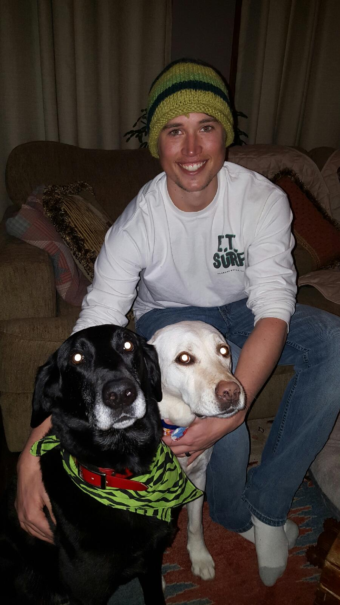

# About Me

My name is Brett Davidson and this is my site dedicated to random tidbits of software engineering knowledge, snowboarding obsessiveness, and anything else I feel like writing about.

I currently live in Cape Canaveral, FL and work for [Ceros](https://www.ceros.com) remotely, where I mainly focus on javascript, php, and ruby development. When I'm not working I enjoy surfing, weight lifting, and planning my next trip out west.

Previously I worked at Rally Software (now CA Technologies) in Boulder, CO where I focused primarily on Java development.